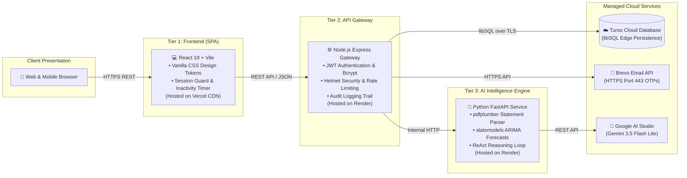

# FinGuide

<div align="center">


[](https://react.dev/)
[](https://expressjs.com/)
[](https://fastapi.tiangolo.com/)
[](https://turso.tech/)
[](https://ai.google.dev/)
[](https://www.brevo.com/)
[](LICENSE)

<p><em>Autonomous personal financial advisory, bank statement verification, and predictive wealth forecasting powered by <strong>Google Gemini 3.5 Flash Lite</strong>.</em></p>

</div>

---

### 📚 Official Documentation Directory

| Document | Category Badge | Purpose & Scope |
| :--- | :---: | :--- |
| [📄 **`PRD.md`**](docs/PRD.md) |  | Product requirements, user personas, problem statement, and success KPIs. |
| [🤖 **`AGENTS.md`**](docs/AGENTS.md) |  | Operational guidelines, checklists, and conventions for AI pair programmers. |
| [🎨 **`DESIGN_SYSTEM.md`**](docs/DESIGN_SYSTEM.md) |  | Drone Blue color palette, typography scale, 8px grid, and component specs. |
| [🏛️ **`ARCHITECTURE.md`**](docs/ARCHITECTURE.md) |  | Distributed system topology, folder structure, end-to-end data flows, and scaling. |
| [🛡️ **`SECURITY.md`**](docs/SECURITY.md) |  | Two-step OTP, 15m lockout cooldown, idle auto-logout, and audit logging trail. |
| [💻 **`CODE_STYLE.md`**](docs/CODE_STYLE.md) |  | React 19 conventions, Python FastAPI standards, and database query safety. |
| [🧪 **`TESTING.md`**](docs/TESTING.md) |  | Test pyramid, backend integration scripts, Playwright visual tests, and checklists. |
| [🚀 **`DEPLOYMENT.md`**](docs/DEPLOYMENT.md) |  | Production topology (Vercel + Render), Turso cloud libSQL, and secret configs. |

---

### 🏛️ System Architecture



---

### ⚡ Quick Start Guide

<table width="100%">
<tr>
<th width="33%" align="left">1️⃣ STEP 1: AI Agent</th>
<th width="33%" align="left">2️⃣ STEP 2: Gateway Server</th>
<th width="33%" align="left">3️⃣ STEP 3: Frontend Client</th>
</tr>
<tr>
<td valign="top">

```bash
cd agent
pip install -r requirements.txt
uvicorn app.main:app --port 8000
```

</td>
<td valign="top">

```bash
cd server
npm install
npm run dev
```

</td>
<td valign="top">

```bash
cd frontend
npm install
npm run dev
```

</td>
</tr>
</table>

Open [**http://localhost:5173**](http://localhost:5173) in your browser.

---

### 🛡️ Production Security Highlights

- 🔒 **Zero-Knowledge Statement Ingestion**: Bank statements are processed in-memory; online banking credentials are never requested or stored.
- 📧 **Two-Step Email OTP**: One-time codes sent via Brevo HTTPS API (port 443) authenticate registrations and password changes.
- ⏱️ **Brute-Force Lockout**: 5 failed login attempts trigger an automatic 15-minute cooldown timer.
- 🔔 **Inactivity Auto-Logout**: Unattended sessions automatically prompt after 13 minutes and log out at 15 minutes.
- ☁️ **Cloud Database Isolation**: User records reside exclusively in encrypted **Turso Cloud** storage; zero personal financial data ever enters Git.
