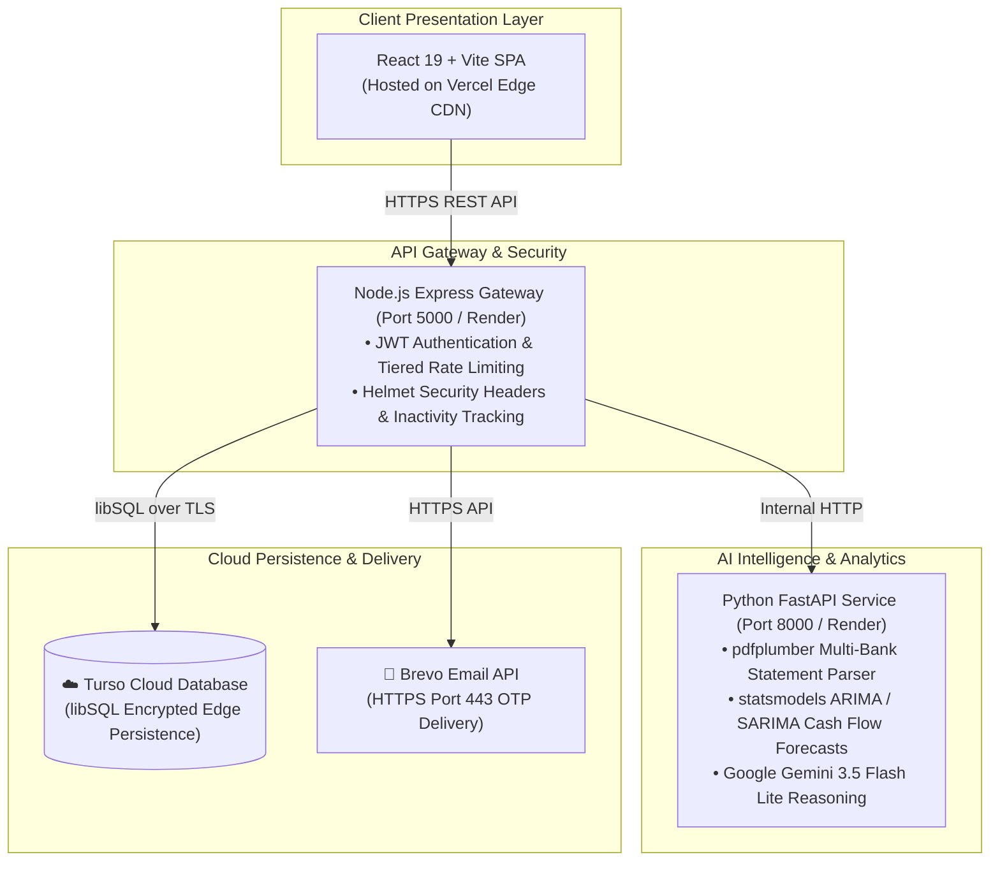

# FinGuide

> **AI Financial Intelligence & Wealth Operating System**

Autonomous personal financial advisory, bank statement verification, and predictive wealth forecasting powered by **Google Gemini 3.5 Flash Lite**.

---

## 📚 Official Documentation Directory

| Document | Category | Summary & Purpose |
| :--- | :---: | :--- |
| [📄 **`PRD.md`**](docs/PRD.md) | `Product Goals` | Product requirements, problem statement, user personas, and success metrics. |
| [🤖 **`AGENTS.md`**](docs/AGENTS.md) | `Agent Rules` | Operational guidelines, quality standards, and checklists for AI coding assistants. |
| [🎨 **`DESIGN_SYSTEM.md`**](docs/DESIGN_SYSTEM.md) | `Design Tokens` | Drone Blue color palette, Plus Jakarta Sans typography, 8px grid, and component specs. |
| [🏛️ **`ARCHITECTURE.md`**](docs/ARCHITECTURE.md) | `System Topology` | Three-tier architecture, project structure, end-to-end data flows, and scalability. |
| [🛡️ **`SECURITY.md`**](docs/SECURITY.md) | `Zero Trust` | Two-step email OTP, 15m lockout cooldown, inactivity auto-logout, and audit logging. |
| [💻 **`CODE_STYLE.md`**](docs/CODE_STYLE.md) | `Engineering` | React 19 conventions, Python FastAPI standards, and database query best practices. |
| [🧪 **`TESTING.md`**](docs/TESTING.md) | `Quality Assurance` | Test pyramid, backend integration scripts, visual tests, and pre-deploy checklist. |
| [🚀 **`DEPLOYMENT.md`**](docs/DEPLOYMENT.md) | `Cloud & Production` | Production hosting topology (Vercel + Render), Turso cloud libSQL, and secrets guide. |

---

## 🏛️ System Architecture

FinGuide is engineered as a three-tier system:



---

## ⚡ Quick Start Guide

### Step 1: Start the Python AI Agent
```bash
cd agent
pip install -r requirements.txt
uvicorn app.main:app --port 8000
```

### Step 2: Start the Node.js API Gateway
```bash
cd server
npm install
npm run dev
```

### Step 3: Start the React Frontend
```bash
cd frontend
npm install
npm run dev
```

Open [http://localhost:5173](http://localhost:5173) in your browser.

---

## 🛡️ Production Security Highlights

- **Bank Statement Privacy**: Statements are parsed directly in-memory; no online banking passwords are ever requested or stored.
- **Two-Step Email OTP**: Verification codes dispatched via Brevo HTTPS API to authenticate registrations, resets, and credential changes.
- **Brute-Force Protection**: 5 consecutive failed login attempts trigger an immediate 15-minute cooldown lockout.
- **Inactivity Guard**: Automatic session lock and logout after 15 minutes of idle time.
- **Cloud Database Isolation**: Production data is encrypted and replicated directly with Turso Cloud; zero user records reside in Git.
