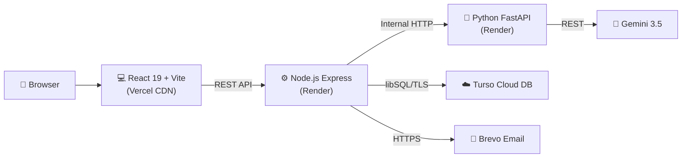

# FinGuide

<div align="center">


[](https://react.dev/)
[](https://expressjs.com/)
[](https://fastapi.tiangolo.com/)
[](https://turso.tech/)
[](https://ai.google.dev/)
[](https://www.brevo.com/)
[](LICENSE)

*Upload your bank statement, get instant financial clarity — powered by AI.*

</div>

---

### What is FinGuide?

I built FinGuide because managing money with spreadsheets is painful and bank aggregator apps ask for too much access. FinGuide lets you drag & drop your bank statement (PDF or CSV), instantly see where your money goes, get cash flow forecasts, and talk to an AI advisor — all without sharing your bank password.

---

### 📚 Documentation

| Doc | What's inside |
| :--- | :--- |
| [📋 PRD.md](docs/PRD.md) | Product goals, target users, and success metrics |
| [🤖 AGENTS.md](docs/AGENTS.md) | Rules and guidelines for AI coding agents |
| [🎨 DESIGN_SYSTEM.md](docs/DESIGN_SYSTEM.md) | Colors, typography, spacing, and component specs |
| [🏛️ ARCHITECTURE.md](docs/ARCHITECTURE.md) | System overview, tech stack, and data flow |
| [🛡️ SECURITY.md](docs/SECURITY.md) | Auth, OTP, lockout, and session security |
| [💻 CODE_STYLE.md](docs/CODE_STYLE.md) | Coding conventions across React, Node, and Python |
| [🧪 TESTING.md](docs/TESTING.md) | Test strategy and pre-deployment checklist |
| [🚀 DEPLOYMENT.md](docs/DEPLOYMENT.md) | Cloud deployment guide and environment setup |

---

### 🏛️ Architecture

Three independent services that talk over REST:



---

### ⚡ Quick Start

<table width="100%">
<tr>
<th align="left">1️⃣ AI Agent</th>
<th align="left">2️⃣ Gateway Server</th>
<th align="left">3️⃣ Frontend</th>
</tr>
<tr>
<td valign="top">

```bash
cd agent
pip install -r requirements.txt
uvicorn app.main:app --port 8000
```

</td>
<td valign="top">

```bash
cd server
npm install
npm run dev
```

</td>
<td valign="top">

```bash
cd frontend
npm install
npm run dev
```

</td>
</tr>
</table>

Open **http://localhost:5173** in your browser.

---

### 🛡️ Security Highlights

- 🔒 **Privacy-first** — statements processed in-memory, bank passwords never requested
- 📧 **Two-step email OTP** — Brevo HTTPS API (port 443) for registration and password resets
- ⏱️ **Brute-force lockout** — 5 failed logins → 15-minute cooldown
- 🔔 **Idle auto-logout** — warning at 13 min, logout at 15 min
- ☁️ **Cloud data isolation** — user data in encrypted Turso Cloud, zero financial data in Git
