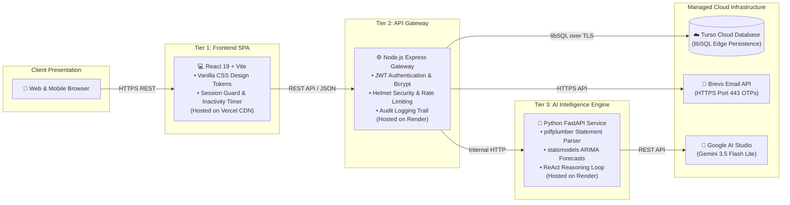

# 🏛️ System Architecture

<div align="center">


<p><em>High-level overview of FinGuide's distributed three-tier architecture, data pipeline, and cloud topology.</em></p>

</div>

---

### 01 System Overview



---

<table width="100%">
<tr>
<th width="50%" align="left">⚙️ 02 Tech Stack</th>
<th width="50%" align="left">📂 03 Project Structure</th>
</tr>
<tr>
<td valign="top">

| Layer | Technologies | Primary Role |
| :--- | :--- | :--- |
| **Frontend** | React 19, Vite, Vanilla CSS | Single Page App, responsive dashboard, charts |
| **Gateway** | Node.js 20+, Express, Helmet | Route dispatch, JWT auth, rate limiting |
| **Database** | Turso Cloud libSQL + SQLite | Cloud persistence, local failover replication |
| **AI Agent** | Python 3.11+, FastAPI | ReAct reasoning, spending diagnostics |
| **LLM** | Gemini 3.5 Flash Lite | Grounded advice & natural language chat |
| **Parser** | `pdfplumber` + regex | Deterministic bank statement extraction |
| **Forecast** | `statsmodels` (ARIMA/SARIMA) | Algorithmic forward cash-flow projection |
| **Email** | Brevo HTTPS API (Port 443) | Transactional OTP delivery worldwide |

</td>
<td valign="top">

```
FinGuide/
├── frontend/          # React 19 SPA (Vercel)
│   ├── src/components/ # Reusable UI components
│   ├── src/pages/      # Dashboard, Upload, Advisor...
│   └── src/index.css   # Complete design token system
├── server/            # Node Express Gateway (Render)
│   ├── src/routes/     # Auth, IE, Goals, Proxy
│   ├── src/services/   # Brevo email, Security, Agent
│   └── src/database.js # Turso cloud sync engine
├── agent/             # Python FastAPI (Render)
│   ├── app/main.py     # FastAPI endpoints
│   ├── app/pdf_parser.py # Statement extraction
│   └── app/react_agent.py # ReAct reasoning loop
└── docs/              # Official repository docs
```

</td>
</tr>
</table>

---

<table width="100%">
<tr>
<th width="50%" align="left">🔄 04 End-to-End Data Flow</th>
<th width="50%" align="left">🚀 05 Scalability & Future Roadmap</th>
</tr>
<tr>
<td valign="top">

1. **User Ingestion**: User uploads a bank statement PDF or CSV via the frontend dropzone.
2. **Gateway Dispatch**: The Express gateway validates authentication, attaches the user context, and streams the file to the Python service.
3. **Deterministic Extraction**: `pdfplumber` extracts table bounding boxes and normalizes transaction balances.
4. **Cloud Replication**: Normalized records are saved to SQLite and synchronized to **Turso Cloud** in real-time.
5. **AI Advisory Review**: When the user asks for guidance, the agent retrieves ledger history, calls Gemini 3.5 Flash Lite, and returns interactive action approval cards.

</td>
<td valign="top">

- ✅ **Decoupled Architecture**: Frontend, Gateway, and AI Agent scale independently on dedicated containers.
- ✅ **Stateless Restarts**: Real-time replication to **Turso Cloud (libSQL)** ensures complete data durability across server restarts.
- ✅ **High-Performance Caching**: Pre-calculated monthly financial metrics reduce redundant database reads.
- ✅ **Asynchronous Batch Queues**: Pluggable worker queues (BullMQ/Celery) ready for high-volume statement processing.
- ✅ **Zero-Trust Security**: Per-user encrypted storage with comprehensive audit logging for all authentication events.

</td>
</tr>
</table>
