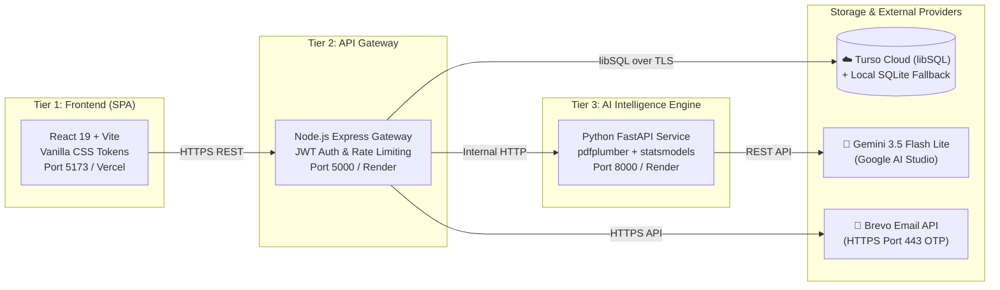
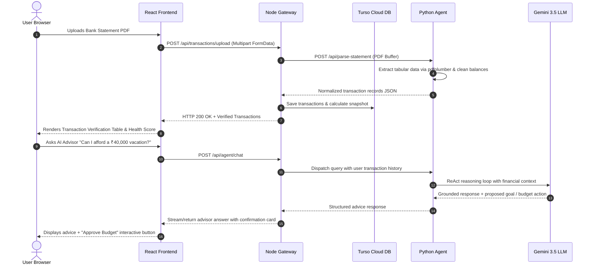

# System Architecture

> **Three-Tier Architecture, Data Flows, Cloud Topology & Scalability**

---

## 1. System Overview

FinGuide operates as a distributed three-tier financial intelligence platform:



---

## 2. Tech Stack

| Layer | Technologies | Key Responsibilities |
| :--- | :--- | :--- |
| **Frontend** | React 19, Vite, Vanilla CSS | Single Page App, responsive dashboards, interactive charts, session guard |
| **API Gateway** | Node.js 20+, Express, Helmet | Route dispatch, JWT authentication, rate limiting, audit logging |
| **Database** | Turso Cloud (libSQL) + SQLite | Encrypted cloud persistence, local replication, WAL mode |
| **AI Agent** | Python 3.11+, FastAPI | ReAct reasoning loop, context retrieval, goal feasibility |
| **LLM Engine** | Google Gemini 3.5 Flash Lite | Financial reasoning, transaction insights, natural conversation |
| **Statement Parser** | `pdfplumber`, regex engine | Deterministic table and transaction extraction from bank statements |
| **Time-Series** | `statsmodels` (ARIMA / SARIMA / ETS) | Algorithmic forward cash-flow projection and anomaly detection |
| **Email Service** | Brevo HTTPS API (Port 443) | Reliable transactional OTP verification across all global email providers |

---

## 3. Project Structure

```
FinGuide/
├── frontend/                     # React 19 SPA (Port 5173 / Vercel)
│   ├── src/
│   │   ├── components/           # Reusable UI components (Sidebar, Drawer, Modals)
│   │   ├── context/              # AuthContext, ThemeContext, AdvisorContext
│   │   ├── pages/                # Dashboard, Upload, Advisor, Guest, Settings...
│   │   ├── utils/                # API client with token refresh & interceptors
│   │   └── index.css             # Comprehensive CSS design tokens & utilities
│   ├── vercel.json               # SPA routing rewrite configuration
│   └── vite.config.js            # Vite build setup with proxy support
│
├── server/                       # Node.js Express Gateway (Port 5000 / Render)
│   ├── src/
│   │   ├── middleware/           # auth.js (JWT validation), rate-limiter.js
│   │   ├── routes/               # auth, ie, goals, transactions, agent, guest
│   │   ├── services/             # email.js (Brevo), security.js, agent-client.js
│   │   ├── config.js             # Environment configuration & fallbacks
│   │   ├── database.js           # Turso cloud sync & SQLite engine
│   │   └── index.js              # Server bootstrap & route registration
│   └── test-api.js               # Sanity test suite for backend routes
│
├── agent/                        # Python FastAPI Intelligence Service (Port 8000 / Render)
│   ├── app/
│   │   ├── main.py               # FastAPI endpoints & route routers
│   │   ├── react_agent.py        # ReAct prompt reasoning loop & tool executor
│   │   ├── analyzer.py           # Financial health metrics computation
│   │   ├── pdf_parser.py         # Multi-format bank statement extraction
│   │   ├── time_series.py        # ARIMA / SARIMA / ETS projection models
│   │   ├── gemini_client.py      # Google Gemini 3.5 Flash Lite client
│   │   ├── guardrails.py         # PII redaction & financial disclaimer guards
│   │   └── schemas.py            # Pydantic request/response data models
│   └── requirements.txt          # Python dependencies
│
└── docs/                         # Repository engineering documentation
    ├── PRD.md                    # Product requirements & user stories
    ├── ARCHITECTURE.md           # This document (System topology)
    ├── DESIGN_SYSTEM.md          # Visual tokens, typography & spacing
    ├── SECURITY.md               # Zero-trust protocols & audit trail
    ├── CODE_STYLE.md             # Code standards & naming conventions
    ├── TESTING.md                # Quality assurance & security test suite
    └── DEPLOYMENT.md             # Production hosting & Turso setup guide
```

---

## 4. End-to-End Data Flow



---

## 5. Scalability & Architectural Guarantees

1. **Decoupled Microservices**: The Express Gateway and Python AI Agent are independently deployable. Heavy PDF parsing and forecasting compute runs isolated without blocking web gateway traffic.
2. **Hybrid Cloud Database**: Writes are atomically synchronized to **Turso Cloud (libSQL)** with a local in-memory SQLite fallback for ultra-fast queries and fault tolerance.
3. **Stateless Authentication**: JWT tokens with short-lived expiries enable horizontal scaling without sticky session dependencies.
4. **Resilient Transaction Handling**: Statement extraction incorporates fuzzy header detection, supporting diverse bank layouts (ICICI, BOB, HDFC, SBI) with graceful fallbacks.
