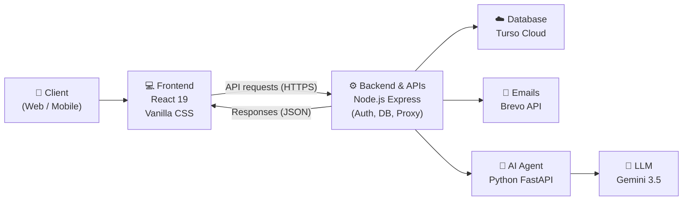

# 🏛️ ARCHITECTURE.md

> 

# Architecture

High-level overview of how FinGuide is structured, what tech I'm using, and how everything connects.

---

### 01 &nbsp; System Overview

A visual overview of how the application works and the main services involved.



---

<table width="100%">
<tr>
<th width="50%" align="left">02 &nbsp; Tech Stack</th>
<th width="50%" align="left">03 &nbsp; Project Structure</th>
</tr>
<tr>
<td valign="top">

Tools and technologies used in the project.

| | Layer | Stack |
| :---: | :--- | :--- |
| 💻 | **Frontend** | React 19, Vite, Vanilla CSS |
| ⚙️ | **Backend** | Node.js, Express, Helmet |
| 🗄️ | **Database** | Turso Cloud (libSQL), SQLite |
| 🔑 | **Authentication** | JWT, Bcrypt, Email OTP |
| 🤖 | **AI Agent** | Python FastAPI, pdfplumber |
| 🧠 | **LLM** | Google Gemini 3.5 Flash Lite |
| 📈 | **Forecasting** | statsmodels (ARIMA/SARIMA) |
| 📧 | **Email** | Brevo HTTPS API |
| 🚀 | **Deployment** | Vercel, Render |

</td>
<td valign="top">

A simplified view of the folder structure.

```
FinGuide/
├── frontend/          # React 19 SPA (Vercel)
│   ├── src/components/  # Reusable UI components
│   ├── src/pages/       # Dashboard, Upload, Advisor
│   └── src/index.css    # Design token system
├── server/            # Node Express Gateway (Render)
│   ├── src/routes/      # Auth, IE, Goals, Proxy
│   ├── src/services/    # Email, Security, Agent
│   └── src/database.js  # Turso cloud sync engine
├── agent/             # Python FastAPI (Render)
│   ├── app/main.py      # FastAPI endpoints
│   ├── app/pdf_parser.py  # Statement extraction
│   └── app/react_agent.py # ReAct reasoning loop
└── docs/              # Project documentation
```

</td>
</tr>
</table>

---

<table width="100%">
<tr>
<th width="50%" align="left">04 &nbsp; Data Flow</th>
<th width="50%" align="left">05 &nbsp; Scalability & Future Considerations</th>
</tr>
<tr>
<td valign="top">

How data moves through the application.

&ensp; ① &ensp; User uploads a bank statement via the frontend dropzone.

&ensp; ② &ensp; Express gateway validates auth and streams the file to the Python agent.

&ensp; ③ &ensp; `pdfplumber` extracts transactions and normalizes balances.

&ensp; ④ &ensp; Records are saved locally and synced to **Turso Cloud** in real time.

&ensp; ⑤ &ensp; When the user asks for advice, the AI agent pulls their history and responds with action cards.

</td>
<td valign="top">

Key areas to consider as the product grows.

- ✅ &ensp; Use modular architecture for easy feature addition.
- ✅ &ensp; Implement caching for better performance.
- ✅ &ensp; Set up background jobs for long-running tasks.
- ✅ &ensp; Monitor usage and set up alerts.
- ✅ &ensp; Consider multi-region deployment as user base grows.

</td>
</tr>
</table>
