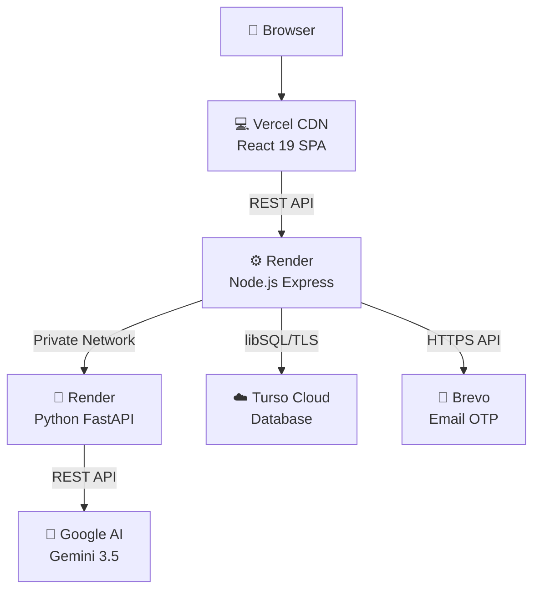

# 🚀 DEPLOYMENT.md

> 

# Deployment & Cloud Architecture

How I deploy FinGuide to production and manage secrets across services.

---

### 01 &nbsp; Cloud Data Isolation

> [!IMPORTANT]
> **"If someone clones my repo, can they access my data?"**
>
> **No.** GitHub only has source code. Your database, user records, and API keys live exclusively in your cloud provider dashboards (Render, Vercel, Turso). They're never committed to Git.

| Pillar | How it's protected |
| :--- | :--- |
| 📂 **Code ≠ Data** | GitHub has React components, Express routes, Python logic. Never databases or user records. |
| 🔑 **Zero secrets in Git** | Connection strings, JWT keys, API tokens — all live in Render/Vercel env vars. |
| 🛡️ **Encrypted connections** | Turso enforces TLS 1.3 + token auth. No unauthorized access. |
| 🚫 **`.gitignore` enforced** | `.env`, `*.db`, `*.sqlite`, `data/`, uploaded PDFs — all blocked from version control. |

---

### 02 &nbsp; Local vs. Production Database

| | Local Dev (SQLite) | Production (Turso Cloud) |
| :--- | :--- | :--- |
| **Storage** | `server/data/finguide.db` | Managed libSQL Cloud |
| **Concurrent users** | Single user | Thousands (edge replication) |
| **Persistence** | ⚠️ Lost on restart | ✅ Always persistent |
| **Backups** | Manual | ✅ Point-in-time recovery |
| **Free tier** | N/A | ✅ Never pauses |

---

### 03 &nbsp; Production Topology

---

### 04 &nbsp; Environment Variables

Set these in your cloud provider's **Settings > Environment Variables** dashboard. Never put them in code.

**Node Gateway (`server`) — Render**

| Variable | Required | Purpose |
| :--- | :---: | :--- |
| `NODE_ENV` | ✅ | `production` — enables optimizations |
| `SECRET_KEY` | ✅ | 64-char random hex for JWT signing |
| `CORS_ORIGIN` | ✅ | Your Vercel frontend URL |
| `TURSO_DATABASE_URL` | ✅ | `libsql://your-db.turso.io` |
| `TURSO_AUTH_TOKEN` | ✅ | Turso database auth token |
| `AGENT_SERVICE_URL` | ✅ | URL to your running Python agent |
| `BREVO_API_KEY` | ✅ | Brevo key for OTP email delivery |
| `SMTP_USER` | Optional | Sender email for Brevo |

**AI Agent (`agent`) — Render**

| Variable | Required | Purpose |
| :--- | :---: | :--- |
| `GEMINI_API_KEY` | ✅ | Google AI Studio API key |
| `GEMINI_MODEL` | Optional | Defaults to `gemini-3.5-flash-lite` |

**Frontend (`frontend`) — Vercel**

| Variable | Required | Purpose |
| :--- | :---: | :--- |
| `VITE_API_URL` | ✅ | Your live Node gateway URL |

---

### 05 &nbsp; Step-by-Step Launch

| Step | Action | Details |
| :---: | :--- | :--- |
| **1** | Push to GitHub | Make sure `.gitignore` is active. `git push origin main`. |
| **2** | Set up Turso | Create a DB at [turso.tech](https://turso.tech). Copy the `libsql://` URL and generate a token. |
| **3** | Deploy AI Agent on Render | Root: `agent`. Build: `pip install -r requirements.txt`. Start: `uvicorn app.main:app --host 0.0.0.0 --port $PORT`. Add `GEMINI_API_KEY`. |
| **4** | Deploy Gateway on Render | Root: `server`. Build: `npm install`. Start: `node src/index.js`. Add all env vars from table above. |
| **5** | Deploy Frontend on Vercel | Import repo. Root: `frontend`. Set `VITE_API_URL`. Click Deploy. |
