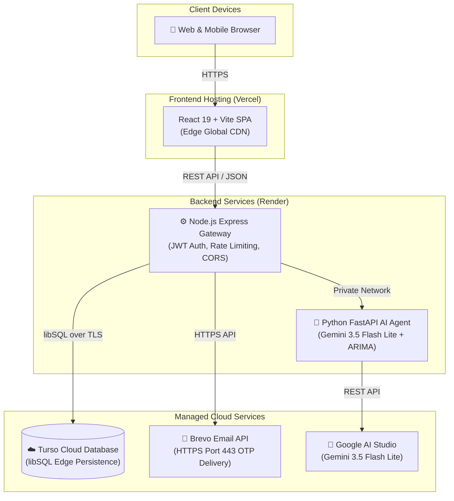

# 🚀 Deployment & Cloud Architecture

<em>Production hosting, database isolation, GitHub security guarantees, and secret management.</em>

---

### 01 Cloud Data Isolation & GitHub Security

> [!IMPORTANT]
> **❓ If someone pulls this project from my GitHub, will they have access to my cloud data?**
>
> **NO, NEVER.** Anyone cloning your public or private GitHub repository has **0% access** to your production cloud database, user records, or secrets.

| Security Pillar | Technical Protection Mechanism |
| :--- | :--- |
| 📂 **Source Code $\neq$ Live Database** | GitHub stores only application code (React components, Express routes, Python logic). It **never** contains running databases, user records, or sessions. |
| 🔑 **Zero Secrets in Git** | Database connection strings, JWT secret keys, and API tokens live **exclusively** inside private cloud provider environment variables (Render, Vercel). They are never committed to Git. |
| 🛡️ **Encrypted Cloud Connections** | Cloud databases enforce TLS 1.3 encryption, token authentication, and private network bindings against unauthorized outside access. |
| 🚫 **Strict `.gitignore` Enforcement** | All `.env`, `*.db`, `*.sqlite`, `data/`, and uploaded PDFs are blocked from version control. |

---

### 02 Database Architecture: Local vs. Production Cloud

| Feature | Local Dev (SQLite) | Production (Turso Cloud libSQL) | Alternative (Supabase Postgres) |
| :--- | :--- | :--- | :--- |
| **Storage Location** | `server/data/finguide.db` | Dedicated Managed libSQL Cloud | Managed Postgres Cluster |
| **Concurrent Users** | Single-user testing | Thousands (Edge replication) | Thousands (Connection pooling) |
| **Stateless Serverless Support**| ⚠️ Ephemeral on restart | ✅ Fully stateless & persistent | ✅ Fully stateless & persistent |
| **Automated Backups** | Manual file copy | ✅ Point-in-time recovery & snapshots | ✅ Daily cloud backups |
| **Free Tier Durability** | N/A | ✅ Never shuts down, zero volume fees | ⚠️ Pauses after 7 days of inactivity |
| **Recommended For** | Local testing & offline demo | **Active Production Default** | Enterprise Postgres installations |

---

### 03 Production Cloud Topology

---

### 04 Secrets & Environment Variables Management

Configure these variables directly inside your cloud platform's **Settings > Environment Variables** dashboard. They are injected at container startup and never written to code repositories.

#### Node Gateway (`server`) — Render Environment Variables

| Variable Name | Required? | Recommended Setting | Purpose |
| :--- | :---: | :--- | :--- |
| `NODE_ENV` | **Yes** | `production` | Enables production optimizations and strips internal debug error traces. |
| `SECRET_KEY` | **Yes** | *Generate 64-char random hex* | Cryptographic salt used for signing and verifying user JWT tokens. |
| `CORS_ORIGIN` | **Yes** | `https://fin-guide-gamma.vercel.app` | Whitelists your production frontend domain to prevent unauthorized origins. |
| `TURSO_DATABASE_URL` | **Yes** | `libsql://your-db-name.turso.io` | Live cloud database connection URL. |
| `TURSO_AUTH_TOKEN` | **Yes** | `eyJhbGciOi...` | Cloud database authentication token. |
| `AGENT_SERVICE_URL` | **Yes** | `https://finguide-agent.onrender.com` | Internal or public URL pointing to the running Python agent service. |
| `BREVO_API_KEY` | **Yes** | `xkeysib-...` | Brevo API key for delivering authentication OTP emails over HTTPS. |
| `SMTP_USER` | Optional | `your-email@gmail.com` | Verified sender email used as default header in Brevo emails. |

> [!NOTE]
> **Variables you can safely remove from Render:**
> - `DATABASE_PATH`: Redundant (defaults automatically to `./data/finguide.db`).
> - `RESEND_API_KEY`: FinGuide uses Brevo HTTPS API (`BREVO_API_KEY`).
> - `SMTP_PASS`: Render blocks outbound SMTP ports 25, 465, and 587. All emails are sent via Brevo HTTPS API (port 443).

#### AI Agent Service (`agent`) — Render Environment Variables

| Variable Name | Required? | Recommended Setting | Purpose |
| :--- | :---: | :--- | :--- |
| `GEMINI_API_KEY` | **Yes** | `AIzaSy...` (Google AI Studio) | Authenticates with Google AI Studio for Gemini 3.5 Flash Lite. |
| `GEMINI_MODEL` | Optional | `gemini-3.5-flash-lite` | Specifies primary reasoning model engine. |

#### Frontend (`frontend`) — Vercel Environment Variables

| Variable Name | Required? | Recommended Setting | Purpose |
| :--- | :---: | :--- | :--- |
| `VITE_API_URL` | **Yes** | `https://finguide-api.onrender.com` | Directs React Axios/fetch requests to your live Node gateway. |

---

### 05 Step-by-Step Production Launch Workflow

| Step | Action | Practical Guidance |
| :---: | :--- | :--- |
| **1** | **Push Clean Codebase to GitHub** | Verify `.gitignore` is active. Run `git push origin main`. Only clean application source files are uploaded. |
| **2** | **Set Up Turso Cloud Database** | Create a database at [turso.tech](https://turso.tech). Copy the `libsql://` database URL and generate an auth token. |
| **3** | **Deploy Python Agent on Render** | Create a New Web Service. Root: `agent`. Build: `pip install -r requirements.txt`. Start: `uvicorn app.main:app --host 0.0.0.0 --port $PORT`. Add `GEMINI_API_KEY`. |
| **4** | **Deploy Express Gateway on Render** | Create a New Web Service. Root: `server`. Build: `npm install`. Start: `node src/index.js`. Add Turso, Brevo, and Secret Key environment variables. |
| **5** | **Deploy React Frontend on Vercel** | Import repo into Vercel. Root: `frontend`. Set `VITE_API_URL` to your live Node API URL. Click Deploy. |
