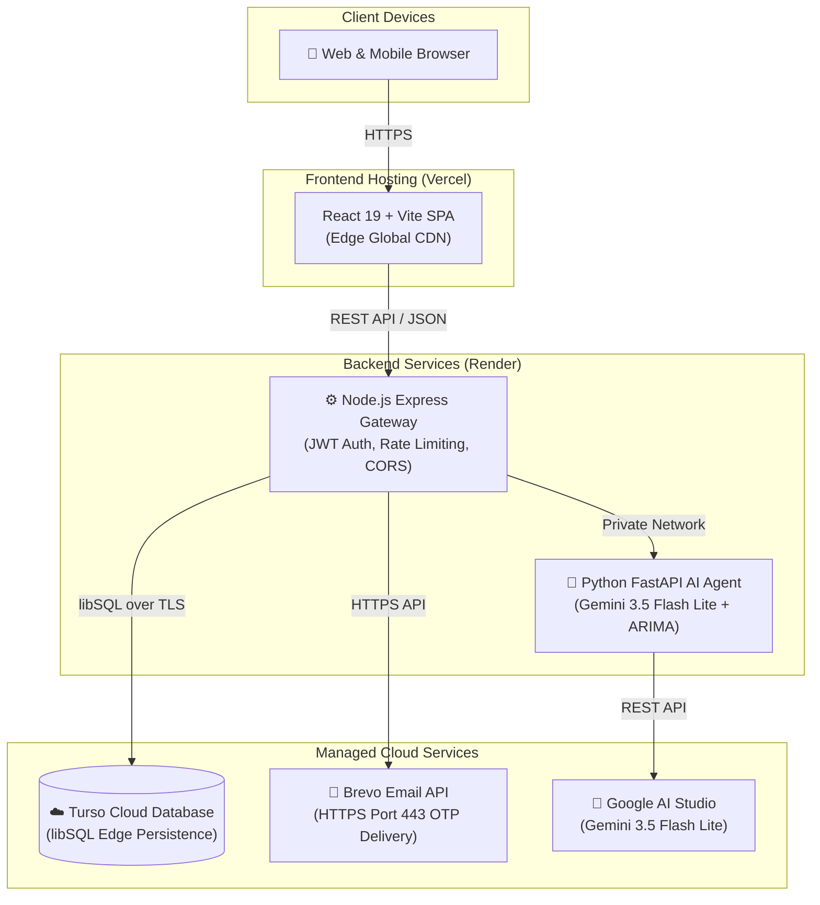
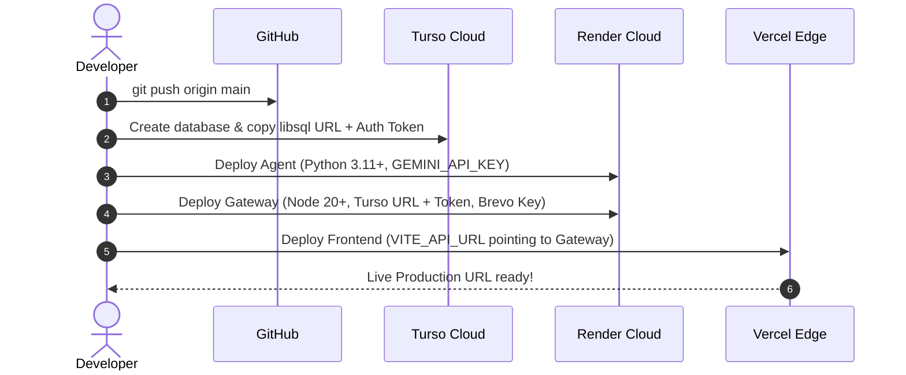

# Deployment & Cloud Architecture

> **Production Hosting, Database Isolation, GitHub Security Guarantees & Secret Management**

---

## 1. Cloud Data Isolation & GitHub Security

### ❓ If someone pulls this project from my GitHub, will they have access to my cloud data?

> [!IMPORTANT]
> **NO, NEVER.** Anyone cloning your GitHub repository has **0% access** to your production cloud database, user records, or financial data.

| Security Pillar | How FinGuide Protects You |
| :--- | :--- |
| 📂 **Source Code $\neq$ Live Database** | GitHub stores only application logic (React components, Express routes, Python algorithms). It **never** contains running databases, user records, or sessions. |
| 🔑 **Zero Credentials in Git** | Database connection strings, JWT secret keys, and API tokens live **exclusively** inside private cloud provider environment variables (Render, Vercel). They are never committed to Git. |
| 🛡️ **Encrypted Cloud Connections** | Cloud databases enforce TLS 1.3 encryption, randomized multi-character tokens, and protected cloud infrastructure. |
| 🚫 **Strict `.gitignore` Enforcement** | All `.env`, `*.db`, `*.sqlite`, `data/`, and uploaded PDFs are blocked from version control. |

---

## 2. Database Architecture: Local vs. Production

FinGuide supports a hybrid architecture designed for zero friction in development and high reliability in production:

| Feature | Local Development (SQLite) | Production (Turso Cloud libSQL) | Legacy / Alternative (Supabase / Postgres) |
| :--- | :--- | :--- | :--- |
| **Storage Location** | `server/data/finguide.db` | Dedicated Managed libSQL Cloud | Dedicated Managed Postgres Cluster |
| **Concurrent Users** | Single-user testing | Thousands (Edge distributed) | Thousands (Connection pooling) |
| **Stateless Serverless Support**| ⚠️ Ephemeral on restart | ✅ Fully stateless & persistent | ✅ Fully stateless & persistent |
| **Automated Backups** | Manual file copy | ✅ Point-in-time recovery & cloud replication | ✅ Point-in-time recovery & daily snapshots |
| **Free Tier Durability** | N/A | ✅ Never shuts down, no volume fees | ⚠️ Pauses after 7 days of inactivity |
| **Recommended For** | Local testing & offline demo | **Active Production Default** | Enterprise Postgres installations |

---

## 3. Recommended Production Cloud Topology



### Infrastructure Summary

- **Frontend (`frontend/`)**: Hosted on **Vercel** with automatic Git deployments, HTTP/3, and global CDN caching.
- **API Gateway (`server/`)**: Hosted on **Render** (Node.js web service) managing auth, rate limiting, and business logic.
- **AI Intelligence Agent (`agent/`)**: Hosted on **Render** (Python FastAPI service) handling statement parsing, statistical forecasts, and Gemini reasoning.
- **Production Database**: **Turso Cloud** (libSQL) providing serverless, persistent, encrypted storage synchronized with local failover.
- **Email Delivery**: **Brevo HTTPS API** sending OTP verification codes worldwide on port 443 (bypassing cloud SMTP port blocks).

---

## 4. Production Secrets & Environment Variables

Variables must be added to your cloud provider dashboards under **Settings > Environment Variables**. They are injected at container startup and never committed to version control.

### Node Gateway (`server`) — Render Environment Variables

| Variable | Required? | Recommended Setting | Purpose |
| :--- | :---: | :--- | :--- |
| `NODE_ENV` | **Yes** | `production` | Enables production optimizations, secure cookies, and stripped debug errors. |
| `SECRET_KEY` | **Yes** | *Generate 64-char hex string* | Cryptographic salt used for signing and verifying user JWT tokens. |
| `CORS_ORIGIN` | **Yes** | `https://fin-guide-gamma.vercel.app` | Whitelists your production frontend domain to prevent unauthorized origins. |
| `TURSO_DATABASE_URL` | **Yes** | `libsql://your-db-name.turso.io` | Live cloud database connection URL. |
| `TURSO_AUTH_TOKEN` | **Yes** | `eyJhbGciOi...` | Cloud database authentication token. |
| `AGENT_SERVICE_URL` | **Yes** | `https://finguide-agent.onrender.com` | Internal or public URL pointing to the running Python agent service. |
| `BREVO_API_KEY` | **Yes** | `xkeysib-...` | Brevo API key for delivering authentication OTP emails over HTTPS. |
| `SMTP_USER` | Optional | `your-email@gmail.com` | Verified sender email used as default header in Brevo emails. |

> [!NOTE]
> **Variables you can safely remove from Render:**
> - `DATABASE_PATH`: Redundant (defaults automatically to `./data/finguide.db`).
> - `RESEND_API_KEY`: FinGuide uses Brevo HTTPS API (`BREVO_API_KEY`).
> - `SMTP_PASS`: Render blocks outbound SMTP ports 25, 465, and 587. All emails are sent via Brevo HTTPS API (port 443).

### AI Agent Service (`agent`) — Render Environment Variables

| Variable | Required? | Recommended Setting | Purpose |
| :--- | :---: | :--- | :--- |
| `GEMINI_API_KEY` | **Yes** | `AIzaSy...` | Authenticates with Google AI Studio for Gemini 3.5 Flash Lite. |
| `GEMINI_MODEL` | Optional | `gemini-3.5-flash-lite` | Specifies reasoning model engine. |
| `PORT` | Auto | Provided by Render | Port injected by Render web service. |

### Frontend (`frontend`) — Vercel Environment Variables

| Variable | Required? | Recommended Setting | Purpose |
| :--- | :---: | :--- | :--- |
| `VITE_API_URL` | **Yes** | `https://finguide-api.onrender.com` | Directs React Axios/fetch requests to your live Node gateway. |

---

## 5. Step-by-Step Production Launch Workflow



### Step 1: Push Clean Codebase to GitHub
Verify `.gitignore` is active and push your repository:
```bash
git status
git push origin main
```

### Step 2: Set Up Turso Cloud Database
1. Go to [Turso Console](https://turso.tech) and create a database (e.g. `finguide-db`).
2. Copy the **Database URL** (`libsql://...`) and generate an **Auth Token**.
3. Add `TURSO_DATABASE_URL` and `TURSO_AUTH_TOKEN` to your Render Node service.

### Step 3: Deploy Python AI Agent on Render
1. Create a **New Web Service** connected to your GitHub repository.
2. Settings:
   - **Root Directory**: `agent`
   - **Runtime**: `Python 3`
   - **Build Command**: `pip install -r requirements.txt`
   - **Start Command**: `uvicorn app.main:app --host 0.0.0.0 --port $PORT`
3. Add `GEMINI_API_KEY` under Environment Variables.

### Step 4: Deploy Node.js Express Gateway on Render
1. Create a **New Web Service** connected to your repository.
2. Settings:
   - **Root Directory**: `server`
   - **Runtime**: `Node`
   - **Build Command**: `npm install`
   - **Start Command**: `node src/index.js`
3. Add environment variables: `NODE_ENV`, `SECRET_KEY`, `CORS_ORIGIN`, `TURSO_DATABASE_URL`, `TURSO_AUTH_TOKEN`, `BREVO_API_KEY`, and `AGENT_SERVICE_URL`.

### Step 5: Deploy React Frontend on Vercel
1. In [Vercel Dashboard](https://vercel.com), click **Add New > Project** and import the repository.
2. Set **Root Directory** to `frontend`.
3. Under **Environment Variables**, set:
   ```env
   VITE_API_URL=https://your-node-api.onrender.com
   ```
4. Click **Deploy**.

---

## 6. Pre-Flight Security & Privacy Checklist

- [x] `.gitignore` active and blocking `.env`, `data/`, and `*.db`
- [x] Zero plain credentials committed to GitHub
- [x] Strong 64-character `SECRET_KEY` set in Render
- [x] Production CORS restricted to `https://fin-guide-gamma.vercel.app`
- [x] Turso cloud database synchronized and encrypted
- [x] Brevo HTTPS email delivery operational for worldwide OTP verification
- [x] 15-minute brute-force lockout and 15-minute inactivity auto-logout active
- [x] HTTPS enforced on all production domains
