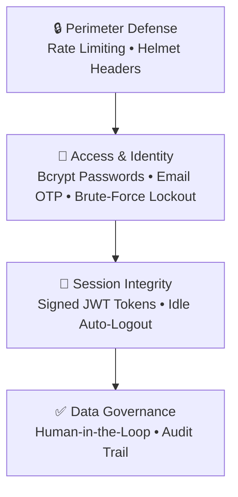

# 🛡️ SECURITY.md

> 

# Security Architecture

How I handle authentication, data privacy, and abuse prevention in FinGuide.

---

### 01 &nbsp; Core Security Model

I built a defense-in-depth approach — four layers that work together. Every request passes through rate limiting and security headers before it even hits the auth layer.

---

<table width="100%">
<tr>
<th width="50%" align="left">02 &nbsp; Password Policy</th>
<th width="50%" align="left">03 &nbsp; Two-Step Email OTP</th>
</tr>
<tr>
<td valign="top">

All passwords must meet these requirements:

- [x] Minimum **8 characters** in length
- [x] At least one **uppercase letter** (A–Z)
- [x] At least one **lowercase letter** (a–z)
- [x] At least one **number** (0–9)
- [x] At least one **special character** (!@#$%^&*)

> [!NOTE]
> Passwords are hashed with **bcrypt** (cost factor 12). Plaintext is never stored, logged, or printed.

</td>
<td valign="top">

OTP codes protect three critical flows:

- **Registration** — confirms you own the email
- **Forgot Password** — required before reset
- **Settings Password Change** — email code needed

> [!TIP]
> Delivered via **Brevo HTTPS API** (port 443) • 10-minute expiry • Single-use • Revoked after 5 bad attempts.

</td>
</tr>
</table>

---

<table width="100%">
<tr>
<th width="50%" align="left">04 &nbsp; Failed Login Lockout</th>
<th width="50%" align="left">05 &nbsp; Session Inactivity Auto-Logout</th>
</tr>
<tr>
<td valign="top">

- **Tracking:** Failed logins tracked by IP + email
- **5 strikes:** Account enters **15-minute cooldown**
- **Frontend:** Submit button disabled, live countdown shown
- **Reset:** Successful login resets the counter to 0

</td>
<td valign="top">

- **Monitors:** Mouse, keyboard, and scroll activity
- **13-min warning:** Modal pops up with a 120-second countdown
- **User choice:** Click "Keep Working" to stay, or let it expire
- **Auto-logout:** Token revoked, redirected to `/login`

</td>
</tr>
</table>

---

### 06 &nbsp; HTTP Headers & Rate Limiting

I use `express-rate-limit` and Helmet on the API Gateway:

| Route | Window | Max Requests | Purpose |
| :--- | :---: | :---: | :--- |
| `/api/*` (Global) | 15 min | 300 | DDoS and bot mitigation |
| `/api/auth/*` | 15 min | 20 | Credential stuffing defense |
| `/api/auth/verify-otp` | 15 min | 25 | Code enumeration prevention |

**Security headers (Helmet):**
- `X-Frame-Options: DENY` — blocks iframe embedding
- `X-Content-Type-Options: nosniff` — prevents MIME sniffing
- `Strict-Transport-Security` — forces HTTPS
- `Referrer-Policy: strict-origin-when-cross-origin`

---

### 07 &nbsp; Security Audit Log

All critical actions are recorded in the `security_logs` table:

| Action | Badge | What triggers it |
| :--- | :---: | :--- |
| `LOGIN_SUCCESS` | 🟢 | User signed in with valid password |
| `LOGIN_FAILED` | 🔴 | Incorrect password submitted |
| `ACCOUNT_LOCKED` | 🔴 | 15-min cooldown after 5 failed attempts |
| `PASSWORD_CHANGED` | 🟢 | Password updated with email verification |
| `DATA_EXPORTED` | 🔵 | User downloaded a JSON/CSV backup |
| `SNAPSHOT_CREATED` | 🟢 | New monthly budget snapshot created |
