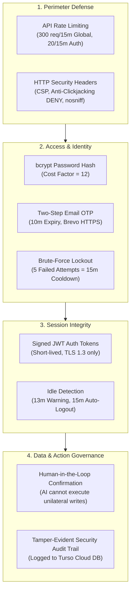

# Security Architecture

> **Zero-Trust Protocols, Email OTP Verification, Rate Limiting & Tamper-Evident Audit Logging**

---

## 1. Core Security Principles

---

## 2. Authentication & Password Policy

All user passwords must satisfy the following strict criteria enforced on both client and server:

- Minimum **8 characters** in length
- At least one **uppercase letter** (`A–Z`)
- At least one **lowercase letter** (`a–z`)
- At least one **numeric digit** (`0–9`)
- At least one **special symbol** (`!@#$%^&*()_+-=[]{}|;:,.<>?`)

> [!NOTE]
> Passwords are encrypted using **bcrypt** with a cost factor of 12 before being saved to the database. Plaintext passwords are never logged, printed, or sent across networks unencrypted.

---

## 3. Two-Step Email OTP Verification

To protect account ownership and prevent unauthorized takeover, FinGuide mandates a one-time verification code (OTP) for:

1. **User Registration**: Ensures the provided email address is valid and owned by the registrant.
2. **Forgot Password Reset**: Authenticates the user before allowing password replacement.
3. **In-App Password Changes**: Confirms account authority before updating login credentials in Settings.

### OTP Delivery Architecture
- **Provider**: **Brevo HTTPS API** (`api-key` header over port 443) delivers emails reliably worldwide without risk of ISP or cloud host SMTP port blocking.
- **Expiry Window**: Verification codes expire strictly after **10 minutes**.
- **Anti-Brute Force**: Exceeding 5 failed verification attempts immediately invalidates and deletes the active code.
- **Single-Use**: Once verified, the OTP is instantly marked consumed and purged.

---

## 4. Failed Login Lockout & Cooldown

To defeat automated brute-force attacks against user passwords:

1. **Attempt Tracking**: Consecutive failed password attempts are tracked in the database by both IP address and account email.
2. **5-Strike Rule**: On the 5th consecutive failure, the account enters a **15-minute lockout cooldown**.
3. **Frontend Enforcement**: The login interface disables the submit button and displays a live countdown timer until the cooldown window elapses.
4. **Automatic Reset**: Successful authentication automatically clears the failure counter.

---

## 5. Session Inactivity Auto-Logout

Unattended browser sessions present a significant risk of financial data exposure. FinGuide enforces automated idle session protection:

- **Activity Listeners**: The frontend tracks keyboard strokes, mouse clicks, and window scroll events.
- **13-Minute Warning**: If zero user activity occurs for 13 minutes, a modal prompt appears with a live **120-second countdown**.
- **Keep Working or Exit**: The user can click *"Keep Working"* to reset the timer, or let it expire to trigger safe token revocation and redirection to the login screen.

---

## 6. HTTP Headers & Rate Limiting

The API Gateway enforces tiered rate limiting using `express-rate-limit`:

| Route Category | Window | Max Requests | Purpose |
| :--- | :---: | :---: | :--- |
| **Global API** (`/api/*`) | 15 minutes | 300 requests | General DDoS and bot mitigation |
| **Auth Routes** (`/api/auth/*`) | 15 minutes | 20 requests | Defense against credential stuffing |
| **OTP Verification** (`/api/auth/verify-otp`) | 15 minutes | 25 requests | Prevention of code enumeration |

### Security Headers (via Helmet)
- `X-Frame-Options: DENY` (Blocks framing inside malicious `<iframe>` tags)
- `X-Content-Type-Options: nosniff` (Prevents MIME sniffing attacks)
- `Strict-Transport-Security: max-age=31536000; includeSubDomains` (Enforces HTTPS)
- `Referrer-Policy: strict-origin-when-cross-origin`

---

## 7. Tamper-Evident Security Audit Log

All critical authentication and data mutations are recorded in the `security_logs` table:

| Action Identifier | User Badge | Trigger Description |
| :--- | :--- | :--- |
| `LOGIN_SUCCESS` | Signed In | User authenticated with correct credentials |
| `LOGIN_FAILED` | Sign-In Failed | Invalid password entered for account |
| `ACCOUNT_LOCKED` | Account Locked | 15-minute cooldown initiated after 5 failed attempts |
| `PASSWORD_CHANGED` | Password Changed | Password successfully reset with verified email OTP |
| `DATA_EXPORTED` | Backup Downloaded | User exported a JSON or CSV financial backup |
| `SNAPSHOT_CREATED` | Budget Created | New income & expense monthly snapshot registered |

Users can inspect their recent security activity at any time inside the **Settings > Security Audit Log** panel.
