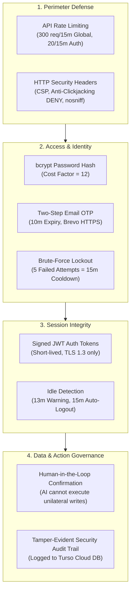

# 🛡️ Security Architecture

<em>Defense-in-depth security model, authentication protocols, rate limiting, and data privacy safeguards.</em>

---

### 01 Core Security Principles

---

<table width="100%">
<tr>
<th width="50%" align="left">🔑 02 Password Policy</th>
<th width="50%" align="left">📧 03 Two-Step Email OTP</th>
</tr>
<tr>
<td valign="top">

All user passwords must satisfy these strict requirements:
- [x] **Minimum 8 characters** in length
- [x] **Uppercase letter** (`A–Z`)
- [x] **Lowercase letter** (`a–z`)
- [x] **Numeric digit** (`0–9`)
- [x] **Special symbol** (`!@#$%^&*()_+-=...`)

> [!NOTE]
> Passwords are encrypted using **bcrypt** (cost factor = 12). Plaintext passwords are never logged, printed, or saved unencrypted.

</td>
<td valign="top">

Mandatory one-time codes (OTP) protect critical flows:
- **Registration**: Confirms user owns the email address
- **Forgot Password**: Verification required to reset credentials
- **Settings Password Change**: Email authorization code needed

> [!TIP]
> Delivered via **Brevo HTTPS API** over port 443 &bull; 10-minute expiry &bull; 5-attempt anti-brute force revocation &bull; Single-use consumption.

</td>
</tr>
</table>

---

<table width="100%">
<tr>
<th width="50%" align="left">⏱️ 04 Failed Login Lockout & Cooldown</th>
<th width="50%" align="left">🔔 05 Session Inactivity Auto-Logout</th>
</tr>
<tr>
<td valign="top">

- **Attempt Tracking**: Consecutive failed logins are tracked by IP address and email.
- **5-Strike Lockout**: On the 5th failed attempt, the account enters a **15-minute cooldown lockout**.
- **Frontend Timer**: Submit button is disabled and a live countdown timer displays remaining cooldown seconds.
- **Reset**: Successful login immediately resets the failure counter to 0.

</td>
<td valign="top">

- **Activity Listeners**: Monitors mouse movements, keyboard typing, and window scrolling.
- **13-Minute Warning**: After 13 minutes of inactivity, a warning modal appears with a **120-second countdown**.
- **User Control**: Users can click *"Keep Working"* to reset the timer, or let it expire to trigger safe token revocation and redirection to login.

</td>
</tr>
</table>

---

### 06 HTTP Headers & Rate Limiting

The API Gateway enforces tiered rate limits via `express-rate-limit`:

| Route Category | Window | Max Requests | Purpose |
| :--- | :---: | :---: | :--- |
| **Global API** (`/api/*`) | 15 minutes | 300 requests | DDoS and bot mitigation |
| **Auth Routes** (`/api/auth/*`) | 15 minutes | 20 requests | Defense against credential stuffing |
| **OTP Verification** (`/api/auth/verify-otp`) | 15 minutes | 25 requests | Prevention of code enumeration |

#### Security Headers (via Helmet)
- `X-Frame-Options: DENY` (Blocks embedding inside malicious `<iframe>` tags)
- `X-Content-Type-Options: nosniff` (Prevents MIME sniffing attacks)
- `Strict-Transport-Security: max-age=31536000; includeSubDomains` (Enforces HTTPS)
- `Referrer-Policy: strict-origin-when-cross-origin`

---

### 07 Tamper-Evident Security Audit Log

All critical mutations are recorded in the `security_logs` table:

| Action Identifier | User-Facing Badge | Trigger Description |
| :--- | :---: | :--- |
| `LOGIN_SUCCESS` | `🟢 Signed In` | User authenticated with valid password |
| `LOGIN_FAILED` | `🔴 Sign-In Failed` | Incorrect password submitted |
| `ACCOUNT_LOCKED` | `🔴 Account Locked` | 15m cooldown initiated after 5 failed attempts |
| `PASSWORD_CHANGED` | `🟢 Password Changed` | Password updated with verified email authorization code |
| `DATA_EXPORTED` | `🔵 Backup Downloaded` | User downloaded a JSON or CSV financial backup |
| `SNAPSHOT_CREATED` | `🟢 Budget Created` | New monthly budget snapshot registered |
