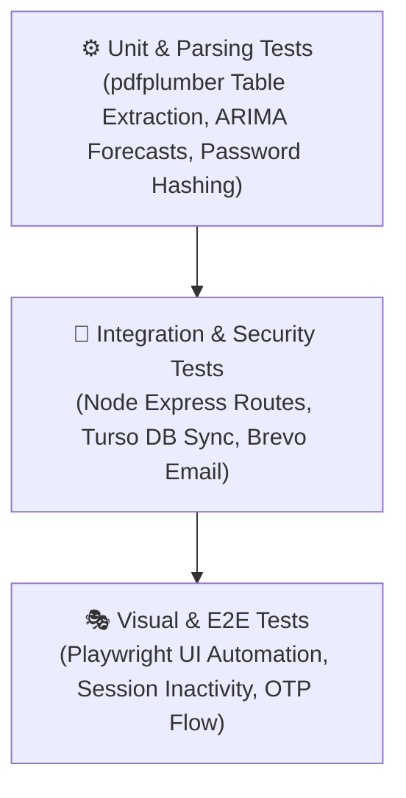

# Quality Assurance & Testing Guide

> **Test Pyramid, Integration Scripts, Security Matrix & Pre-Deployment Verification**

---

## 1. Testing Pyramid



| Layer | Scope | Key Test Targets |
| :--- | :--- | :--- |
| **E2E / Browser** | End-to-end user experience | OTP registration modals, login lockout banners, inactivity countdown, bank statement upload dropzone. |
| **Integration** | Service-to-service communication | Express to Python FastAPI communication, Turso cloud database sync, JWT authentication headers. |
| **Unit** | Core algorithms & logic | Deterministic PDF statement parsing, ARIMA time-series modeling, bcrypt hashing, password regex. |

---

## 2. Automated Test Execution

### 1. Backend Security & Database Migration Test
Verify that the database schema boots cleanly and Turso cloud synchronization connects without error:

```bash
cd server
node --input-type=module -e "
import { initializeDatabase } from './src/database.js';
await initializeDatabase();
console.log('✅ Turso Cloud & SQLite initialization successful!');
"
```

### 2. Frontend Production Build Verification
Verify syntax, dependencies, asset bundling, and CSS token validity:

```bash
cd frontend
npm run build
```

### 3. AI Agent Health & Model Verification
Confirm Python dependencies, Gemini client credentials, and FastAPI routes:

```bash
cd agent
python -c "
from app.main import app
from app.config import settings
print(f'✅ Agent app loaded successfully using model: {settings.gemini_model}')
"
```

### 4. API End-to-End Flow Test
Run the comprehensive API test suite covering registration, auth, I&E snapshots, and AI advisor:

```bash
cd server
node test-api.js
```

---

## 3. Security Verification Matrix

| Test Scenario | Trigger Condition | Expected Result |
| :--- | :--- | :--- |
| **Failed Login Lockout** | 5 consecutive incorrect passwords submitted | HTTP 429 response; 15-minute cooldown timer displayed on frontend; submit locked. |
| **Anti-Brute Force OTP** | 5 invalid verification codes entered | Active code is revoked and permanently deleted from the database. |
| **Session Inactivity** | 13 minutes of zero user input detected | Inactivity warning modal displayed with 120-second live countdown. |
| **Unattended Auto-Logout** | 15 total minutes of inactivity elapse | Auth token is purged from client storage and user is redirected to `/login`. |
| **Clickjacking Defense** | Web application loaded inside an external `<iframe>` | Blocked by browser via Helmet `X-Frame-Options: DENY`. |
| **MIME Sniffing Defense** | Malicious content-type manipulation | Enforced via `X-Content-Type-Options: nosniff`. |

---

## 4. Pre-Deployment Checklist

Before merging into `main` and deploying to production, verify:

- [x] **Git Status**: Working tree is clean and `.env` / database files are uncommitted.
- [x] **Frontend Build**: `npm run build` completes with 0 errors in `frontend/`.
- [x] **Database Sync**: Turso cloud connection string and auth token are verified.
- [x] **Email Service**: Brevo HTTPS API key is verified and test email succeeds.
- [x] **Environment Variables**: All required secrets are configured in Render and Vercel.
- [x] **Documentation**: All `.md` documents in `docs/` reflect the latest architecture and features.
