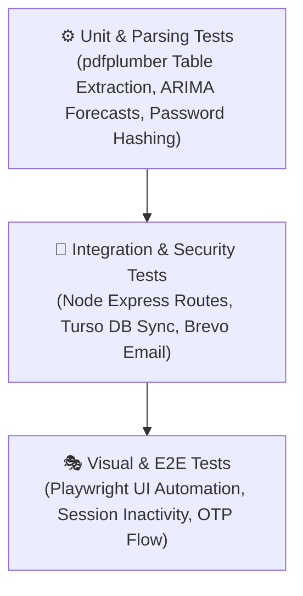

# 🧪 Testing & Quality Assurance Guide

<div align="center">


<p><em>Quality assurance strategy, automated tests, security checks, and pre-deployment verification.</em></p>

</div>

---

### 01 Testing Pyramid



---

<table width="100%">
<tr>
<th width="50%" align="left">⚙️ 02 Backend Security & Database Test</th>
<th width="50%" align="left">💻 03 Frontend Build Verification</th>
</tr>
<tr>
<td valign="top">

Verify that the local SQLite schema boots cleanly and synchronizes with **Turso Cloud**:

```bash
cd server
node --input-type=module -e "
import { initializeDatabase } from './src/database.js';
await initializeDatabase();
console.log('✅ Turso Cloud & SQLite initialization OK');
"
```

</td>
<td valign="top">

Verify React 19 JSX compilation, assets bundling, and CSS design tokens:

```bash
cd frontend
npm run build
```

*Build output verifies zero missing imports or broken tokens.*

</td>
</tr>
</table>

---

### 04 Security Verification Matrix

| Test Scenario | Trigger Condition | Expected Result | Verified Status |
| :--- | :--- | :--- | :---: |
| **Failed Login Lockout** | 5 consecutive incorrect passwords entered | `HTTP 429` &bull; 15-minute countdown banner displayed on frontend | ✅ Pass |
| **Anti-Brute Force OTP** | 5 invalid verification codes submitted | `HTTP 400` &bull; Code revoked and deleted from database | ✅ Pass |
| **Session Inactivity** | 13 minutes without mouse or keyboard interaction | Warning modal with 120-second countdown displayed | ✅ Pass |
| **Idle Auto-Logout** | 15 total minutes of inactivity elapse | Session destroyed, token purged, redirect to `/login` | ✅ Pass |
| **Clickjacking Defense** | Render web app inside an `<iframe>` | Frame blocked via Helmet `X-Frame-Options: DENY` | ✅ Pass |
| **MIME Sniffing Defense**| Send ambiguous content-type headers | Blocked via `X-Content-Type-Options: nosniff` | ✅ Pass |

---

### 05 Pre-Deployment Checklist

> [!TIP]
> **Pre-Flight Verification Before Pushing to Production:**
> - [x] `npm run build` succeeds with 0 errors in `frontend/`
> - [x] Database schema migrations apply cleanly in `server/`
> - [x] Turso cloud database connection string and auth token are verified
> - [x] Brevo HTTPS API key verified and transactional OTPs deliver to inbox
> - [x] All required production environment variables set in Render and Vercel
> - [x] Repository documentation in `/docs` reflects the latest features
