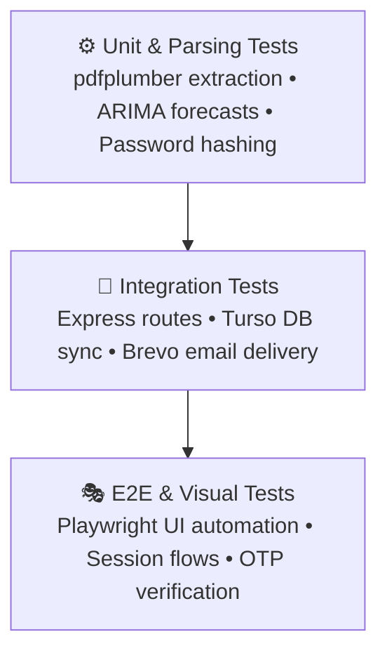

# 🧪 TESTING.md

> 

# Testing & Quality Assurance

How I verify that everything works before pushing to production.

---

### 01 &nbsp; Testing Pyramid



---

<table width="100%">
<tr>
<th width="50%" align="left">02 &nbsp; Backend & Database Tests</th>
<th width="50%" align="left">03 &nbsp; Frontend Build Verification</th>
</tr>
<tr>
<td valign="top">

Verify that the SQLite schema boots and syncs with **Turso Cloud**:

```bash
cd server
node --input-type=module -e "
import { initializeDatabase } from './src/database.js';
await initializeDatabase();
console.log('✅ Turso Cloud & SQLite OK');
"
```

</td>
<td valign="top">

Verify React 19 compilation, asset bundling, and CSS tokens:

```bash
cd frontend
npm run build
```

*Build passes = zero missing imports or broken tokens.*

</td>
</tr>
</table>

---

### 04 &nbsp; Security Verification Matrix

| Test Scenario | Trigger | Expected Result | Status |
| :--- | :--- | :--- | :---: |
| Failed login lockout | 5 wrong passwords | `429` + 15-min countdown | ✅ |
| Anti-brute-force OTP | 5 invalid codes | `400` + code revoked | ✅ |
| Session inactivity | 13 min idle | Warning modal + 120s countdown | ✅ |
| Idle auto-logout | 15 min idle | Session destroyed, redirect `/login` | ✅ |
| Clickjacking defense | Render in `<iframe>` | Blocked by `X-Frame-Options: DENY` | ✅ |
| MIME sniffing defense | Ambiguous content-type | Blocked by `nosniff` header | ✅ |

---

### 05 &nbsp; Pre-Deployment Checklist

> [!TIP]
> Run through this before every production push:
>
> - [x] `npm run build` passes with 0 errors in `frontend/`
> - [x] Database migrations apply cleanly in `server/`
> - [x] Turso Cloud connection string and auth token verified
> - [x] Brevo API key works and OTPs arrive in inbox
> - [x] All env variables set in Render and Vercel
> - [x] Docs in `/docs` are up to date
